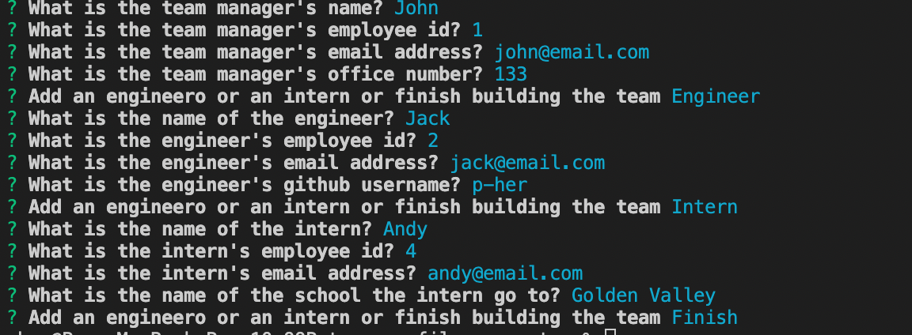

# Team-Profile-Generator

## Purpose
To create a node.js command-line application that will prompt the user some questions to be answer about the employees on the software engineering team. And use that information to generates a summary HTML webpage.

## Built With:
- Inquirer
- HTML
- CSS, Bootstrap
- JavaScript, jQuery
- Font Awesome

# GitHub Link
https://github.com/p-her/team-profile-generator

# Video Link
https://watch.screencastify.com/v/7T5lfpWdQu4Yh6KsMaZ3